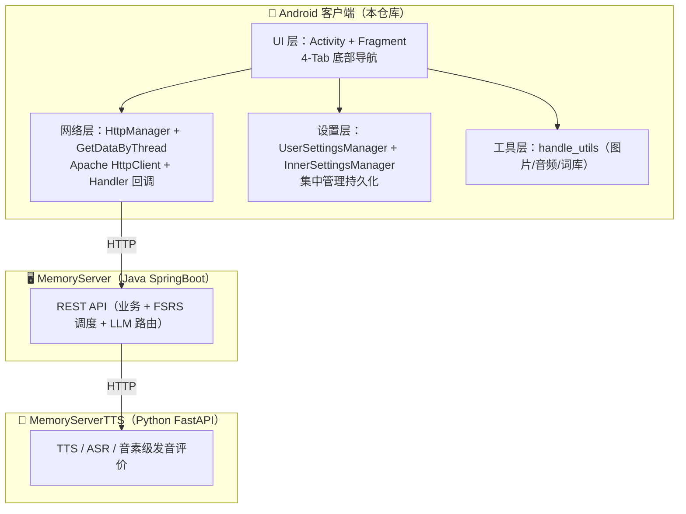

# Memory App — 项目全景总览（Project Overview）

> **版本**：1.0 | **更新日期**：2026-08-04
>
> 面向 AI 辅助开发 / 新成员。**请先读本文件建立全局观**，再深入技术文档与约束文档。
> 关联：[开发约束与规范](development-conventions.md)（必读）、[项目技术文档](project-technical-documentation.md)（技术细节）。

---

## 1. 项目一句话

**Memory** 是一款 Android 英语学习 App（Java 11，minSdk 26，targetSdk 34），提供 FSRS 科学背词、听写、作文批改、发音评测、AI 对话、每日阅读等能力。客户端（本仓库）与两个服务端协同：**MemoryServer**（Java Spring Boot 业务后端）与 **MemoryServerTTS**（Python FastAPI 语音 AI 中台）。

## 2. 系统架构（三层）



## 3. 客户端模块清单

| 模块 | 包路径（`ui/` 下） | 职责 | 备注 |
|------|-------------------|------|------|
| 主界面导航 | `MainActivity.java` | 4-Tab 底部导航（单词学习 / 宝藏箱 / 每日阅读 / 用户中心），show/hide Fragment + 滑动动画 | 新增页面需在此注册 |
| 认证 | `auth_view/` | 登录 / 注册，登录态由 `InnerSettingsManager` 管理 | |
| 初始化 | `init_view/` | 词书选择、学习计划制定 | |
| 单词学习 | `main_view/` | FSRS 背词卡片（选择题/输入题）、总结卡片、跨夜检测 | 卡片容器 `WordCardContainer` 支持滑动/fling |
| 宝藏箱 | `treasure_view/` | 听写 / 作文批改 / 发音 / AI 对话 / 学习评估 五个子模块 | |
| 每日阅读 | `main_view/DailyReadingFragment.java` | AI 生成阅读文章、长难句/高频词分析、收藏夹 | |
| 用户中心 | `main_view/UserHomeFragment.java` | 个人信息、头像上传、昵称修改 | |
| 扩展 | `extra_view/` | 我的词书、多源查词、计划管理、设置页 | |

## 4. 技术栈

| 层次 | 选型 |
|------|------|
| UI | AndroidX AppCompat + Material 1.10.0 + ConstraintLayout |
| 网络 | Apache HttpClient（自定义 `HttpManager` 封装）+ `GetDataByThread` |
| 异步 | `Handler` / `Message`（主线程 Looper） |
| JSON | `org.json` 手动解析 |
| 图片 | Glide 4.12 + `BitmapManager`；裁剪 uCrop（`UcropHelper`） |
| Markdown | Markwon 4.6.2（每日阅读） |
| 图表 | MPAndroidChart 3.1.0（评估） |
| 音频 | `AudioPlayer`（有道 TTS）+ `MemAudioRecord`（PCM 16kHz） |
| 词库 | `res/raw/` 60+ JSON，`LexiconResourceMap` 按需加载 |

## 5. 关键目录

```text
app/src/main/java/com/deepsleep/memory/
├── MainActivity.java        # 底部导航容器
├── network/                 # ApiConstants(环境切换) / HttpManager / GetDataByThread / CozeAPI
├── settings/                # UserSettingsManager / InnerSettingsManager / ThemeHelper
├── handle_utils/            # BitmapManager / AudioPlayer / MemAudioRecord / lexicon 词库
└── ui/                      # 各 feature 页面（auth_view / init_view / main_view / treasure_view / extra_view）
```

## 6. 已有基础设施清单（⚠️ 防重复造轮子，动手前必查）

> 新增能力前，先在此表检索 + 代码 `grep` 确认；已存在的不要重写。

| 能力 | 实现位置 | 说明 |
|------|---------|------|
| **全部 HTTP 请求** | `network/HttpManager` + `network/GetDataByThread` | 所有业务 API 方法在 `GetDataByThread` 中扩展 |
| **异步回调** | `Handler(Looper.getMainLooper())` | 项目统一模式 |
| **用户偏好持久化** | `settings/UserSettingsManager` | 学习模式 / 滑动方向 / 每日新词 / 阅读字号 / 主题 |
| **内部信息持久化** | `settings/InnerSettingsManager` | 登录信息 / 每日收藏 / 作文草稿 / 发音成绩 |
| **学习进度持久化** | `main_view/DailyStateManager` | 今日已完成单词（跨天重置） |
| **环境切换** | `network/ApiConstants.setEnvironment()` | DEV / TEST / PROD |
| **图片处理** | `handle_utils/BitmapManager` | 解码 / 缩放 / 旋转 |
| **音频播放** | `handle_utils/AudioPlayer` | 有道 TTS 发音 |
| **录音** | `handle_utils/MemAudioRecord` | PCM 16kHz 16bit |
| **词库加载** | `handle_utils/lexicon/LexiconResourceMap` | 60+ 词库 + 缓存 |
| **相机拍照** | `ui/components/CameraCaptureActivity` | 自定义相机（4:3 分辨率策略） |
| **图片裁剪** | `ui/components/UcropHelper` + uCrop | 主题化裁剪 |
| **对话框** | `MaterialAlertDialogBuilder` | 全项目统一 |
| **Markdown 渲染** | Markwon | 每日阅读 |
| **主题** | `settings/ThemeHelper` | 跟随系统 / 浅色 / 深色 |
| **图表** | MPAndroidChart | 学习评估 |
| **查词** | `ui/extra_view/word_search_view/SearchingActivity` | 多源查词 + WebView |

## 7. 核心数据流

```text
用户操作 → Activity/Fragment
        → GetDataByThread（后台线程）
        → HttpManager（Apache HttpClient）
        → 后端 API
        → JSON 响应 → Handler.handleMessage() → 主线程更新 UI
```

**持久化访问**（一律经管理器，禁止直接 `getSharedPreferences`）：

```text
Activity/Fragment → UserSettingsManager / InnerSettingsManager / DailyStateManager
```

## 8. 构建与环境

```bash
.\gradlew.bat assembleDebug     # 编译 Debug
.\gradlew.bat installDebug      # 安装到设备
.\gradlew.bat test              # 单元测试
.\gradlew.bat connectedAndroidTest  # 仪器化测试
```

- 默认环境：`GetDataByThread` 构造设为 **TEST**。
- 后端地址在构建时从本地 `local.properties` 注入（`BACKEND_DEV_URL` / `BACKEND_TEST_URL` / `BACKEND_PROD_URL`），经 `app/build.gradle` 写入 `BuildConfig`，由 `ApiConstants` 统一读取；真实地址不提交到版本库。
- 发布前务必通过 `ApiConstants.setEnvironment()` 确认环境。

## 9. 文档导航

| 文档 | 内容 | 何时阅读 |
|------|------|---------|
| `docs/project-overview.md`（本文件） | 项目总览 + 已有能力清单 | 每次动手前 |
| `docs/development-conventions.md` | 开发约束与规范（红线） | 每次动手前 / 写代码时 |
| `docs/project-technical-documentation.md` | 模块技术细节、API 清单、理论基础 | 深入某模块时 |
