# Memory App — 项目技术文档

> **版本**：2.1 | **日期**：2026-08-04 | **目标平台**：Android (minSdk 26, targetSdk 34) | **开发语言**：Java 11
>
> **2.1 更新要点**：设置管理系统全面集中化（所有 SharedPreferences 收敛到 settings 管理器）；Activity Result API 迁移完成；卡片滑动 fling 支持。
> 关联：[项目全景总览](project-overview.md)、[开发约束与规范](development-conventions.md)。

---

## 目录

1. [项目概述](#1-项目概述)
2. [教育心理学理论基础](#2-教育心理学理论基础)
3. [系统全景架构](#3-系统全景架构)
4. [项目结构](#4-项目结构)
5. [认证模块](#5-认证模块)
6. [初始化设置模块](#6-初始化设置模块)
7. [主界面与导航系统](#7-主界面与导航系统)
8. [每日单词学习模块 — FSRS 间隔重复](#8-每日单词学习模块--fsrs-间隔重复)
9. [宝藏箱 — 听写练习模块](#9-宝藏箱--听写练习模块)
10. [宝藏箱 — 作文批改模块](#10-宝藏箱--作文批改模块)
11. [宝藏箱 — 发音练习模块](#11-宝藏箱--发音练习模块)
12. [宝藏箱 — AI 对话模块](#12-宝藏箱--ai-对话模块)
13. [宝藏箱 — 学习评估模块](#13-宝藏箱--学习评估模块)
14. [每日阅读模块](#14-每日阅读模块)
15. [用户中心模块](#15-用户中心模块)
16. [扩展功能模块](#16-扩展功能模块)
17. [网络通信层](#17-网络通信层)
18. [工具与辅助模块](#18-工具与辅助模块)
19. [设置管理系统](#19-设置管理系统)
20. [第三方依赖](#20-第三方依赖)
21. [构建与部署](#21-构建与部署)

---

## 1. 项目概述

### 1.1 项目简介

**Memory** 是一款面向英语学习者的 Android 应用，集成了词汇学习、听写练习、作文批改、发音训练、AI 对话和每日阅读等多种学习功能。作为"Memory 英语学习生态"的**客户端核心**，它与以下两个服务端项目协同工作：

| 项目 | 角色 | 技术栈 | 端口 |
|------|------|--------|------|
| **MemoryServer** | 业务后端 | Java 17 + Spring Boot 3.5 + MySQL + MyBatis-Plus | 8080 |
| **MemoryServerTTS** | 语音 AI 中台 | Python 3.12 + FastAPI + Qwen3-TTS + Faster-Whisper | 8000 |

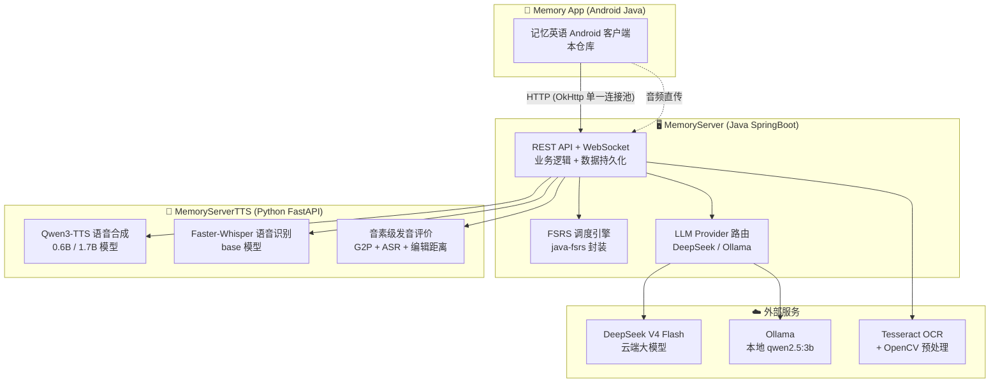

### 1.2 核心功能矩阵

| 功能模块 | 描述 | 核心能力 | 理论学习依据 |
|----------|------|----------|-------------|
| 每日单词学习 | FSRS 间隔重复背词 | 选择题/填空题双模式、智能复习调度 | 提取练习效应、间隔学习理论 |
| 听写练习 | 音频播放 + 手写/键盘作答 | 多级听写（单词/短语/句子）、OCR 拍照识别、UCrop 裁剪 | 生成效应、情境认知理论 |
| 作文批改 | AI 语法纠错与评分 | OCR 拍照提取文字、AI 自动批改、亮点分析 | 输出假说、最近发展区理论 |
| 发音练习 | 跟读评测 | 录音上传、音素级发音诊断、逐词反馈 | 语音意识理论、刻意练习 |
| AI 对话 | 自由口语练习 | 文字/语音双模式、五维质量评估、TTS 语音回复 | 情境认知理论、交互假说 |
| 每日阅读 | AI 生成阅读材料 | Markdown 渲染、生词标注、句子翻译、文章收藏 | Krashen 输入假说 |
| 学习评估 | 数据仪表盘 | 掌握度分布、FSRS 深度指标、AI 个性化建议 | 元认知监控、自我调节学习 |
| 词书管理 | 60+ 词库支持 | CET4/6、IELTS、TOEFL、GRE 等 | — |

### 1.3 用户流程

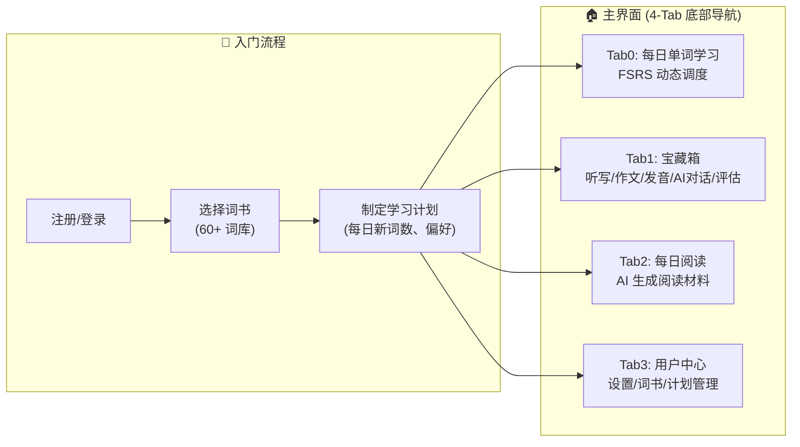

---

## 2. 教育心理学理论基础

Memory 项目的核心设计深受以下教育心理学理论的指导，这也是系统区别于普通背词工具的差异化优势所在。

### 2.1 提取练习效应（Retrieval Practice Effect）

> **核心命题**：从记忆中主动提取信息，比被动重复阅读更能强化长期记忆。

**理论背景**：Karpicke & Roediger（2008）在 *Science* 上发表的经典实验表明，在学习了外语单词对后，"学习+测试"组在一周后的回忆率（约 80%）远高于"学习+重复学习"组（约 36%）。这被称为**测试增强效应（Testing Effect）**。

**在 Memory 中的体现**：

| 功能 | 提取练习的体现 |
|------|-------------|
| **填空题模式** | 用户看到释义，必须从记忆中主动提取单词拼写 → 深度提取（Recall） |
| **选择题模式** | 用户看到单词，从 4 个选项中识别正确释义 → 再认（Recognition），较浅但仍有提取 |
| **听写练习** | 听到音频后写出拼写 → 跨模态提取（听觉→书写） |
| **发音跟读** | 看到文本后主动发音 → 产出性提取 |

**填空题为何比选择题更有效**：根据 Bjork（1994）的"必要难度"（Desirable Difficulties）理论，提取过程中的困难如果能被成功克服，就能产生更强的记忆痕迹。填空题需要回忆（Recall），选择题只需要再认（Recognition），前者提取深度更大。这也解释了为什么应用在学习模式中区分两种模式——初期用选择题建立信心，后期用填空题加深巩固。

### 2.2 间隔重复与 FSRS（Spaced Repetition）

> **核心命题**：在即将遗忘的临界点进行复习，记忆效率最大化。

**理论背景**：Ebbinghaus（1885）的遗忘曲线揭示了记忆随时间的指数衰减规律。间隔重复通过计算每个知识点的遗忘临界点，在最恰当的时间安排复习。

**FSRS（Free Spaced Repetition Scheduler）** 是 2022 年提出的新一代间隔重复算法，与传统的 SM-2（Anki 默认算法）相比：

| 对比维度 | SM-2（Anki 默认） | FSRS（Memory 采用） |
|---------|-----------------|-------------------|
| **状态模型** | EF（Ease Factor）单变量 | 稳定性 $S$ + 难度 $D$ + 可提取性 $R$ 三变量 |
| **遗忘模拟** | 指数衰减 | 遗忘曲线 + 难度调节 |
| **参数可优化** | 固定参数 | 可通过个人数据优化 17 个参数 |
| **可预测性** | 只能预测下次复习 | 可预测任意时刻的回忆概率 |

**三变量模型**：

| 变量 | 符号 | 单位 | 含义 |
|------|------|------|------|
| **稳定性** | $S$ | 天 | 记忆半衰期——$S=10$ 意味着 10 天后回忆概率降到 50% |
| **难度** | $D$ | 1-10 | 单词固有难度，$D$ 越高越难记住 |
| **可提取性** | $R$ | 0-1 | 当前时刻成功回忆的概率 |

$$R(t) = 0.5^{\,t/S}$$

其中 $t$ 是距上次复习的天数。当 $R$ 降到目标阈值（默认 0.9）以下时，FSRS 将该单词纳入复习队列。

**在 Memory 中的体现**：FSRS 计算在 MemoryServer 端完成（`FSRSService.java` 封装 `java-fsrs` 库），客户端通过 `/learning/getTodayTask` 获取调度结果，通过 `/learning/submitAnswer` 提交作答数据，形成一个完整的学习闭环。

### 2.3 情境认知理论（Situated Cognition）

> **核心命题**：知识不能脱离其使用情境而被孤立地学习。

**理论背景**：Brown, Collins & Duguid（1989）提出，知识是情境化的，是活动、情境和文化的产物。

**在 Memory 中的体现**：

| 功能 | 情境化设计 |
|------|-----------|
| **听写 L2/L3** | 单词嵌入短语/句子语境中播放。例如 "apple" 不是直接听写，而是听 "a red ____" |
| **AI 对话** | 模拟真实英语对话场景，在自然互动中使用英语 |
| **每日阅读** | 利用薄弱词汇生成包含这些词的自然文章，在上下文阅读中习得词汇 |
| **作文批改** | 在真实写作中应用语言知识，AI 在完整语境中评估和纠错 |

**核心设计理念**：Memory 不仅是一个"背词工具"，而是一个"英语使用环境模拟器"——用户不是孤立地记忆单词，而是在听、说、读、写的真实语境中反复接触和使用目标词汇。

### 2.4 Krashen 输入假说与 Swain 输出假说

| 理论 | 核心主张 | 在 Memory 中的实现 |
|------|---------|------------------|
| **输入假说** (Krashen, 1985) | 语言习得依赖"可理解输入"（i+1） | 每日阅读基于薄弱词生成文章；AI 对话自动调节难度 |
| **输出假说** (Swain, 1985) | 仅有输入不够，语言产出（说/写）同样关键 | 发音跟读（说）、作文批改（写）、AI 对话（说）、听写（写）全面覆盖 |

### 2.5 元认知与自我调节学习

**在 Memory 中的体现**：学习评估模块的仪表盘、趋势图、掌握度分布和深度分析，帮助用户**看见自己的学习**。这是元认知监控（Metacognitive Monitoring）工具——用户通过了解自己的学习状态（哪些词薄弱、掌握率如何、趋势上升还是下降），能够更有意识地调整学习策略，实现自我调节学习（Self-Regulated Learning, Zimmerman, 2002）。

---

## 3. 系统全景架构

### 3.1 三层架构全景图

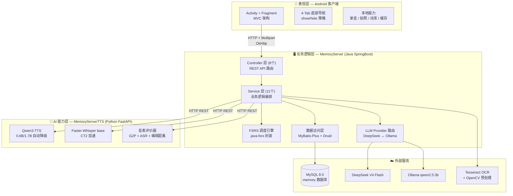

### 3.2 客户端架构模式

项目采用 **传统 MVC + Fragment 导航** 架构。核心设计决策：

| 设计决策 | 选择 | 理由 |
|---------|------|------|
| UI 容器 | Activity + Fragment | Android 原生导航方案，兼容性好 |
| 异步模型 | Handler + Message（`ApiConstants.execute` 共享线程池） | 项目一致性，避免引入 RxJava/Coroutines |
| 网络层 | OkHttp（`MemoryApiClient` 唯一入口 + Retrofit 域接口 + `ApiBridge` 桥接） | 单一共享连接池（`MemoryApiClient.client()`）、超时/重试统一 |
| 持久化 | SharedPreferences | 轻量配置存储，无需 Room 的重量级 |
| 图片加载 | Glide 4.12 | 成熟稳定，支持 circleCrop 等变换 |
| JSON 解析 | org.json 手动解析 | 项目约定，不使用 Gson/Moshi |

### 3.3 数据流全景

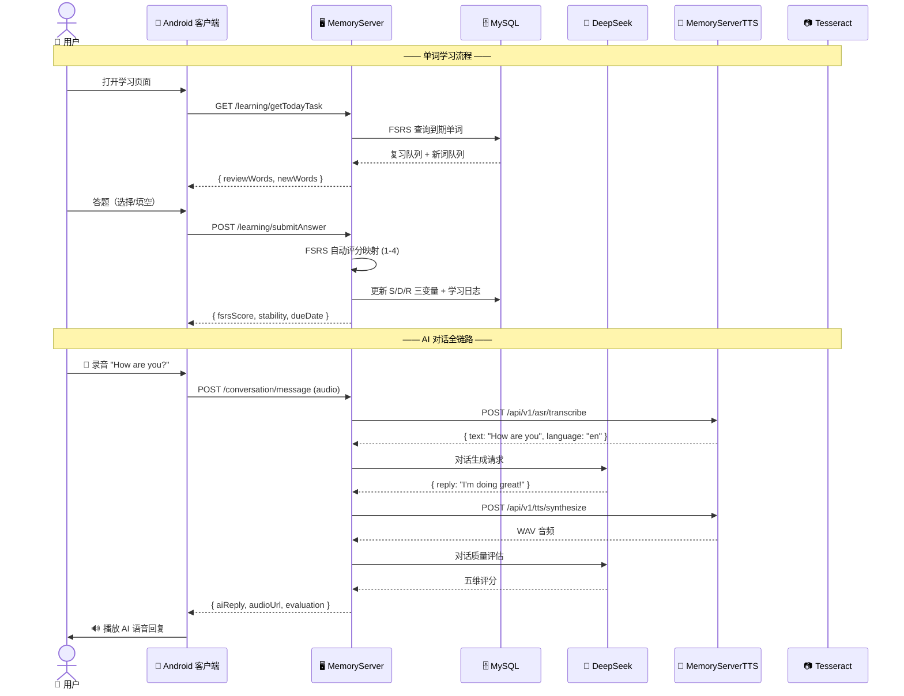

---

## 4. 项目结构

```text
d:\Codes\Memory\
├── AGENTS.md                          # AI 编码助手指南
├── build.gradle                       # 根构建配置（Android Gradle Plugin 8.x）
├── settings.gradle                    # Gradle 设置
├── gradle.properties                  # Gradle 属性
├── local.properties                   # 本地 SDK 路径
├── reasonix.toml                      # Reasonix 配置
├── docs/                              # 文档目录
│   ├── project-overview.md                # 项目全景总览 + 已有能力清单
│   ├── development-conventions.md         # 开发约束与规范
│   └── project-technical-documentation.md # 技术文档（本文件）
├── gradle/wrapper/                    # Gradle Wrapper
└── app/
    ├── build.gradle                   # 应用构建配置（依赖管理）
    ├── proguard-rules.pro             # 混淆规则
    ├── libs/                          # 本地 JAR 库
    ├── sampledata/                    # 示例数据
    └── src/
        ├── androidTest/               # 仪器化测试 (Espresso 3.5.1)
        ├── test/                      # 单元测试 (JUnit 4.13.2)
        └── main/
            ├── AndroidManifest.xml    # 应用清单（15+ Activity 声明）
            ├── res/                   # 资源文件
            │   ├── layout/            # 布局文件 (30+)
            │   ├── drawable/          # 图片/矢量图/Shape Drawable
            │   ├── anim/              # 切换动画资源
            │   ├── raw/               # 原始资源（60+ 词库 JSON）
            │   └── xml/               # XML 配置 (file_paths)
            └── java/com/deepsleep/memory/
                ├── network/           # 网络通信层
                │   ├── ApiConstants.java      # 环境切换 (DEV/TEST/PROD) + getFullUrl + 共享线程池
                │   ├── MemoryApiClient.java   # 唯一入口：Retrofit 域接口工厂 + 底层专用能力（单一共享连接池）
                │   ├── ApiBridge.java         # Handler/Message 桥接（enqueue）
                │   └── MemoryApi.java + 域接口 (AuthApi 等)  # Retrofit 声明式接口
                ├── settings/          # 设置管理
                │   ├── UserSettingsManager.java  # 用户偏好单例 + 观察者
                │   └── InnerSettingsManager.java # 账户级数据管理
                ├── handle_utils/      # 工具类
                │   ├── BitmapManager.java     # 图片解码/缩放
                │   ├── AudioPlayer.java       # 有道词典 TTS 播放
                │   ├── MemAudioRecord.java    # PCM 录音 (16kHz 16bit)
                │   ├── AdapterTool.java       # 适配器工具
                │   └── lexicon/               # 本地词库
                │       ├── LexiconResourceMap.java  # 60+ 词库映射+缓存
                │       └── WordEntry.java           # 词条数据模型
                └── ui/                # 界面层
                    ├── MainActivity.java        # 底部导航容器
                    ├── components/              # 可复用组件
                    ├── auth_view/               # 登录/注册
                    ├── init_view/               # 词书选择/计划制定
                    ├── main_view/               # 主页 4 个 Fragment
                    ├── treasure_view/           # 宝藏箱子模块
                    │   ├── dictation_view/      # 听写练习
                    │   ├── composition_view/    # 作文批改
                    │   ├── pronunciation_view/  # 发音练习
                    │   ├── aichat_view/         # AI 对话
                    │   └── evaluation_view/     # 学习评估
                    └── extra_view/              # 扩展功能
                        ├── my_word_view/        # 我的词书 (ViewPager2)
                        ├── word_search_view/    # 多源查词 (ViewPager2 + WebView)
                        ├── plan_view/           # 计划管理
                        └── setting_view/        # 设置页
```

---

## 5. 认证模块

### 5.1 设计思路

认证模块是整个系统的入口，设计原则是**简洁实用**。考虑到这是学习工具而非金融系统，采用轻量级的手机号+密码认证方案，不做 JWT/Session 管理，而是让客户端在每次请求 Header 中直接携带 `userId` 作为身份标识。

**与 MemoryServer 的联动**：服务端 `AuthService` 负责手机号唯一性校验、密码匹配，以及登录后的 `login_count++` 和 `last_login_time` 更新。头像管理采用"上传即压缩、异步删旧"策略。

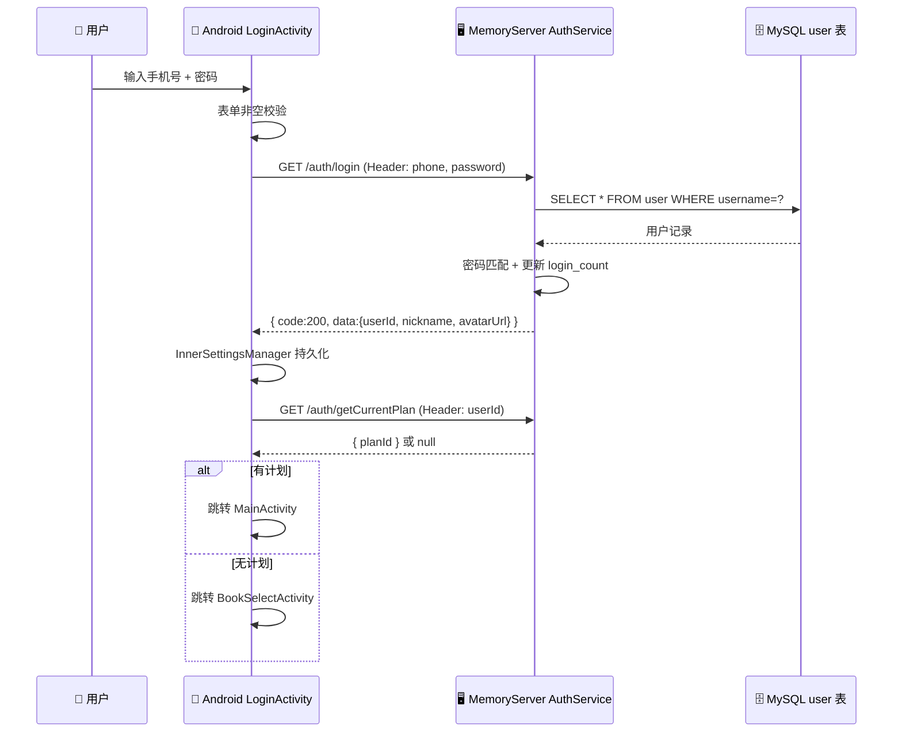

### 5.2 涉及文件

| 文件 | 职责 |
|------|------|
| `LoginActivity.java` | 登录主界面，表单验证，密码找回 |
| `RegisterActivity.java` | 注册界面，自动生成 5 位随机昵称 |
| `MemoryApiClient.java`（`auth()` 域） | 封装 `/auth/login`、`/auth/register` 等 API |
| `InnerSettingsManager.java` | 持久化登录态、用户信息（SharedPreferences） |

### 5.3 技术实现

#### 5.3.1 登录状态管理

```java
// InnerSettingsManager 中的三种登录状态
KEY_IS_LOGGED_IN = 0  // 未登录 → 每次启动跳转 LoginActivity
KEY_IS_LOGGED_IN = 1  // 首次注册后自动登录 → 仍需引导词书选择
KEY_IS_LOGGED_IN = 2  // 老用户 → 直接进入 MainActivity
```

每次进入 `MainActivity` 时检查 `KEY_IS_LOGGED_IN`，若为 0 则跳回 `LoginActivity`。这种设计避免了每次启动都要重新登录，同时区分了新用户（需要初始化引导）和老用户（直接进入主界面）。

#### 5.3.2 Handler 异步回调模式（项目统一约定）

所有网络请求遵循下面的 `Handler + Message` 模式——这是项目的核心编码约定：

```java
// 定义消息码
private static final int msg_success = 1;
private static final int msg_failed = -1;

// Handler 在主线程处理回调
class MyHandler extends Handler {
    @Override
    public void handleMessage(@NonNull Message msg) {
        if (msg.what == msg_success) {
            String result = (String) msg.obj;
            JSONObject json = new JSONObject(result);
            // 解析 JSON → 更新 UI
        } else {
            Toast.makeText(context, "请求失败", Toast.LENGTH_SHORT).show();
        }
    }
}
```

**设计考量**：项目刻意保持使用 `android.os.Handler` + `Message` 模式做 UI 回调（而非 LiveData/协程），
原因是在保证网络底层现代化（OkHttp）的同时维持 UI 层回调风格一致性，避免全量重写 UI 层。

#### 5.3.3 头像管理

头像上传采用三阶段策略：用户选择图片 → `ImageCompressUtil` 等比缩放 → 保存到 MemoryServer 的 `avatars/{userId}/` 目录 → `@Async` 异步删除旧头像（最多重试 5 次，不阻塞主流程）。客户端使用 Glide 的 `circleCrop()` 显示圆形头像，通过 `/auth/avatar/{userId}` 端点直接获取图片二进制流渲染。

---

## 6. 初始化设置模块

### 6.1 设计思路

新用户首次登录后，需要完成两步初始化：(1) 选择一本词书；(2) 制定每日学习计划。采用顺序 Activity 跳转，数据通过 Intent Bundle 传递。

### 6.2 涉及文件

| 文件 | 职责 |
|------|------|
| `BookSelectActivity.java` | 词书选择（60+ 词库，按标签分类筛选） |
| `PlanDevelopmentActivity.java` | 制定学习计划（每日新词数、学习模式、FSRS 保留率） |
| `BookAdapter.java` | 词书列表 RecyclerView 适配器 |

### 6.3 技术实现

#### 6.3.1 词书选择

**数据源**：`BookSelectActivity.loadBooksFromJson()` 解析本地 JSON 配置，按标签（CET4、CET6、IELTS、TOEFL、GRE 等）分类展示。顶部标签栏动态生成 Tag Button 支持按标签筛选，列表项显示书名、单词数量、描述。

#### 6.3.2 学习计划制定

| 配置项 | 控件 | 默认值 | 学习理论依据 |
|--------|------|--------|-------------|
| 每日新词数 | NumberPicker | 10 | 认知负荷管理——小批量学习优于一次性大量学习 |
| 学习模式 | Switch | 选择题 | 必要难度理论——初期低难度建立信心，后期高难度加深记忆 |
| FSRS 保留率 | Slider | 0.90 | 间隔学习中"遗忘临界点"的可调参数 |

`POST /learning/planUpload` 提交完整计划 JSON 后，服务端创建 `user_plan` 和首日 `user_learning_list` 记录。成功后设置 `KEY_IS_LOGGED_IN = 2`，跳转 `MainActivity`。

---

## 7. 主界面与导航系统

### 7.1 设计思路

采用 **4 Tab 底部导航** 的经典移动端布局，通过 Fragment 的 `show()/hide()` 而非 `replace()` 管理页面切换：

| 策略 | 优势 |
|------|------|
| `show()/hide()` ✅ | 内存高效：Fragment 只实例化一次，状态保持（滚动位置/输入内容不丢失） |
| `replace()` ❌ | 每次切换都重建 Fragment，浪费资源 |

### 7.2 涉及文件

| 文件 | 职责 |
|------|------|
| `MainActivity.java` | 底部导航容器，Fragment 生命周期管理，方向感知动画 |
| `activity_main.xml` | 主界面布局（4 个 LinearLayout Tab + FrameLayout 内容区） |
| `slide_in_left.xml` / `slide_out_right.xml` 等 | 方向感知滑入滑出动画 |

### 7.3 Tab 结构与切换机制

```java
Tab 0 → WordLearningFragment    // 每日单词学习（FSRS 调度）
Tab 1 → TreasureBoxFragment     // 宝藏箱（五大练习模块入口）
Tab 2 → DailyReadingFragment    // 每日阅读（AI 生成 + Markdown 渲染）
Tab 3 → UserHomeFragment        // 用户中心（设置/词书/计划）
```

**方向感知动画**：当用户从 Tab 0 切换到 Tab 1（右滑），新 Fragment 从右侧滑入；从 Tab 1 切回 Tab 0（左滑），新 Fragment 从左侧滑入。这一设计模拟了物理空间中的翻页直觉，降低用户认知负担。

---

## 8. 每日单词学习模块 — FSRS 间隔重复

### 8.1 设计思路

每日单词学习是应用的核心功能。基于 **FSRS（Free Spaced Repetition System）** 算法，服务端根据用户的记忆状态（可提取性 $R$、难度 $D$、稳定性 $S$）动态安排每日新词和复习词。客户端支持两种学习模式：

- **选择题模式（Choice Mode）**：4 选 1，降低认知负荷，适合初期学习。猜对概率 25%，因此服务端自动降低评分（正确最多得 3，错误直接得 1）。
- **填空题模式（Input Mode）**：手动输入拼写，加深记忆，适合巩固阶段。需要主动回忆，提取深度更大。

### 8.2 涉及文件

| 文件 | 职责 |
|------|------|
| `WordLearningFragment.java` | 每日学习主逻辑：任务加载、卡片管理、进度追踪 |
| `WordCard.java` | 单词数据模型（含 FSRS 状态字段） |
| `WordCardContainer.java` | 自定义可滑动卡片容器（Tinder 式交互） |
| `ExerciseCardFactory.java` | 工厂模式生成选择题/填空题卡片视图 |
| `DailyStateManager.java` | 每日进度管理（跨天重置、SharedPreferences 持久化） |
| `SummaryCardBuilder.java` | 学习总结卡片构建（三级数据恢复） |

### 8.3 客户端-服务端联动全流程

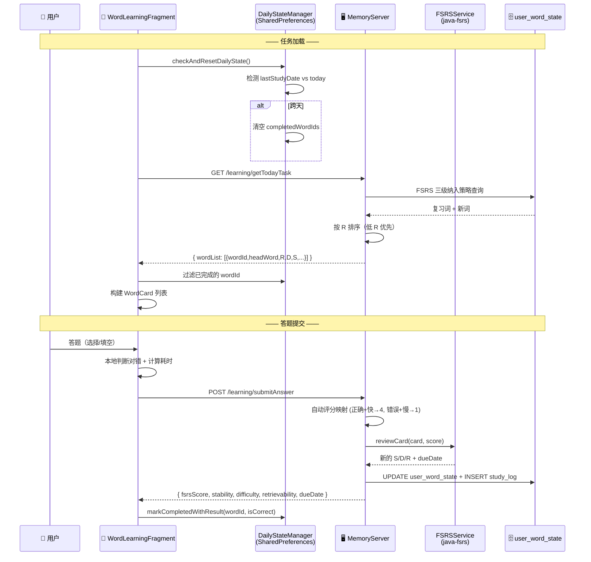

### 8.4 单词数据模型

```java
class WordCard {
    long word_id;           // 单词 ID
    String word;            // 拼写
    String definition;      // 释义
    String example;         // 例句
    String usPhone/ukPhone; // 音标（美式/英式）
    int type;               // 0=新词, 1=复习词

    // FSRS 记忆状态（从服务端获取）
    float retrievability;   // 可提取性 R (0-1)
    float difficulty;       // 难度 D (1-10)
    float stability;        // 稳定性 S (天数)
    int lastScore;          // 上次评分 (1=Again, 2=Hard, 3=Good, 4=Easy)

    // 客户端练习状态
    long displayStartTime;  // 卡片展示时间戳（用于计算响应时间）
    boolean isCorrect;      // 本次是否答对
}
```

### 8.5 卡片容器设计（Tinder 式交互）

`WordCardContainer.java` 实现了类似 Tinder 的滑动卡片效果，但需要保留子 View 的触摸交互（按钮点击、EditText 输入）。

**触摸事件分发策略**：

```java
@Override
public boolean onInterruptTouchEvent(MotionEvent ev) {
    // 如果子 View 可交互（按钮/输入框），不拦截事件
    if (isInteractiveChild(targetChild)) {
        return false;  // 子 View 处理触摸
    }
    // 否则拦截，交由父容器处理滑动翻页
    return true;
}
```

**关键交互**：
- **滑动翻页**：左右滑动卡片，`ValueAnimator` 驱动平移 + 透明度变化
- **长按标记**：`Handler.postDelayed(runnable, 1000)` 实现 1 秒长按，标记单词
- **卡片层叠**：`STACK_OFFSET_X = 60f`，模拟卡片堆叠视觉效果
- **右滑返回**：设置中可开启，右滑回到上一张已答卡片

### 8.6 FSRS 评分映射（服务端）

`/learning/submitAnswer` 的请求体包含 `{userId, wordId, lexiconId, headWord, isCorrect, responseTimeMs, studyMode}`。服务端的 `LearningService` 根据作答情况自动映射到 FSRS 四级评分：

| 条件 | FSRS 评分 | Rating | S 变化 | D 变化 |
|------|----------|--------|--------|--------|
| 正确 + 响应快（< 3s） | 4 | Easy | $S_{new} = S_{old} \times w_9 \times e^{w_{10}}$（指数增长） | D 降低 |
| 正确 + 响应慢（≥ 3s） | 3 | Good | $S_{new} = S_{old} \times w_8$（正常增长） | D 微调 |
| 错误 + 响应快（< 8s） | 2 | Hard | $S_{new} = S_{old} \times w_7$（小幅增加） | D 增加 |
| 错误 + 响应慢（≥ 8s） | 1 | Again | $S_{new} = S_{old} \times w_6$（大幅降低） | D 增加 |

选择题模式额外降级：正确最多得 3，错误直接得 1。这是为了补偿选择题 25% 的随机猜对概率。

### 8.7 每日状态管理（跨天重置）

`DailyStateManager` 基于 SharedPreferences 实现：

| 存储键 | 值 | 说明 |
|--------|---|------|
| `{userId}_completedWordIds` | JSONArray | 今日已完成的所有 wordId |
| `{userId}_completedWordDetails` | JSONArray | 完成详情（含正确性、拼写） |
| `{userId}_lastStudyDate` | String (yyyy-MM-dd) | 上次学习日期 |

**跨天检测逻辑**：`onResume()` 时检查 `lastStudyDate` 是否等于今天。若不等，清空完成列表，重置日期。这确保用户每天打开应用时看到全新的学习任务。

### 8.8 总结卡片（三级数据恢复）

`SummaryCardBuilder` 在列表详情展示时采用三级数据恢复策略：
1. **SharedPreferences 持久化数据**（进程被杀后可恢复，最可靠）
2. **内存中的 currentCardMap**（当前会话可用，最快）
3. **本地词库 LexiconResourceMap**（兜底方案——仅能恢复拼写和释义）

展示内容：正确/错误统计（饼图）、每个单词的拼写 + 释义、可点击播放有道词典发音。

---

## 9. 宝藏箱 — 听写练习模块

### 9.1 设计思路

听写模块模拟课堂听写场景，结合**听力辨识**与**拼写输出**双重训练。核心设计原则：

- **三级听写体系**：L1 单词独立 → L2 短语语境 → L3 句子语境，难度递进，符合"最近发展区"理论
- **FSRS 动态选词**：基于每个单词的稳定性 $S$ 和难度 $D$ 筛选听写内容
- **语境化学习**：L2/L3 级别由 DeepSeek 生成包含目标词的自然语境，体现情境认知理论
- **Cooling 冷却机制**：20 分钟强制冷却防止滥用，保证学习质量
- **双作答方式**：键盘输入 + OCR 拍照识别手写答案

### 9.2 三级听写体系

| 级别 | 听写内容 | 触发条件 | 播放示例 | 教育心理学原理 |
|------|----------|----------|----------|-------------|
| L1 | 单词独立 | $S < 3$ 天 或 $D > 0.8$ | 播放 `apple` | 基础提取练习——刚开始学习的词需要直接提取 |
| L2 | 短语语境 | $3 \leq S < 21$ 天 且 $D \leq 0.8$ | 播放 `a red ____` | 情境认知——在最小可理解语境中回忆 |
| L3 | 句子语境 | $S \geq 21$ 天 且 $D \leq 0.6$ | 播放 `She bit into a crisp ____.` | 深度情境化——完整句法环境中的词汇提取 |

**headWord ≠ targetForm 的设计**：当听写词需要变形时（如 headWord="contain" 但在语境中应写 "container"），`headWord` 是提示词，`targetForm` 是正确答案。这一设计支持了词汇形态学变化的训练。

### 9.3 涉及文件

| 文件 | 职责 |
|------|------|
| `DictationMenuActivity.java` | 听写入口：历史记录列表 + 生成新任务 |
| `DictationGenerateActivity.java` | 任务生成页面：参数配置、音频轮询、PDF 打印 |
| `DictationExecutionActivity.java` | **核心执行页**：逐词播放、输入/拍照作答、倒计时 |
| `DictationResultActivity.java` | 成绩展示：逐题详情、评分汇总、错词重练入口 |
| `DictationModels.java` | 数据模型：DictationTask、DictationItem、SubmitResult |
| `DictationApiHelper.java` | API 封装层：生成/查询/提交/历史/重练 |

### 9.4 服务端联动全景

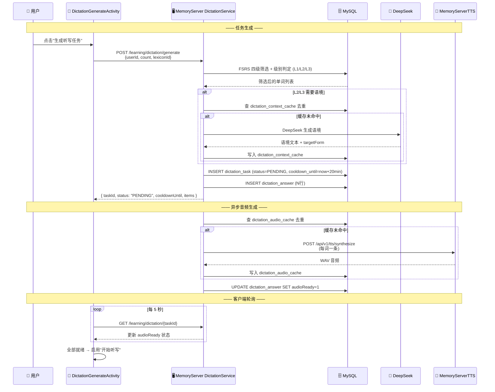

### 9.5 听写执行核心流程

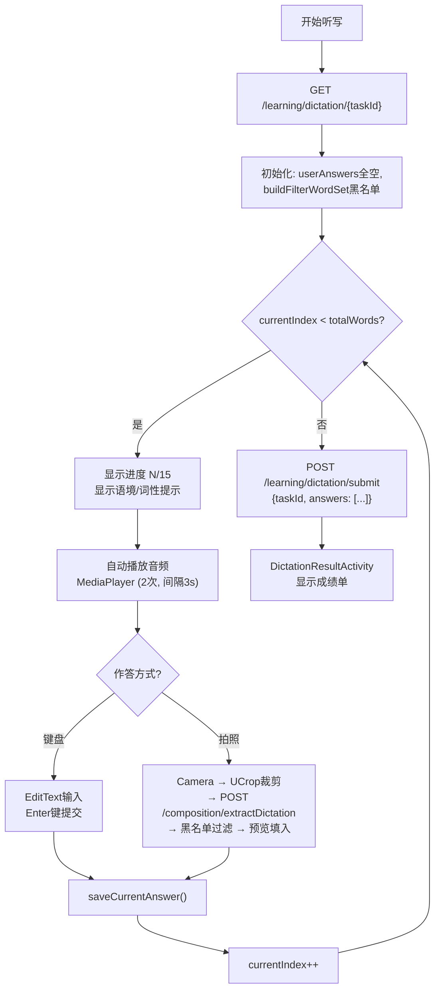

### 9.6 OCR 拍照识别流程详解

听写 OCR 与作文 OCR 有根本区别——听写 OCR 需要"知道用户拍了哪一题"，并将识别结果填入对应词槽。

**核心挑战**：听写单上包含全部单词的提示词（headWord），OCR 会将提示词误认为答案。

**解决方案 — 三层过滤策略**：

```
相机拍照 → UCrop 手动裁剪书写区域 → 上传 MemoryServer
    ↓
MemoryServer: 听写专用 OCR (/composition/extractDictation)
    ├─ 分区识别：检测水平分隔线 → 提取书写方框 ROI
    ├─ 手写友好预处理：自适应阈值 (Sauvola)，不做激进二值化
    └─ 词典纠偏：OCR 结果与 targetForm 做编辑距离纠偏 (≤2 + 首字母一致 → 校正)
    ↓
客户端接收 OCR 文本 → 解析与过滤:
    ├─ Layer 1: 正则提取 "序号. word" 模式 → candidates
    ├─ Layer 2: 兜底按行提取 ≥2 字母的单词 → candidates
    ├─ Layer 3: 过滤 filterWordSet (headWord 黑名单)
    │   └─ ⚠️ targetForm 不在黑名单中——正确答案绝不被过滤
    └─ 取第一个有效候选词
    ↓
预览填入 EditText + Toast "已识别并填入，请核对"
```

| 字段 | 是否加入黑名单 | 原因 |
|------|:---:|------|
| `headWord` | ✅ 是 | 打印在听写单提示区，OCR 会识别到，不应作为答案 |
| `targetForm` | ❌ 否 | 这就是正确答案，绝不能过滤 |
| `contextText` 中的其他词 | ❌ 否 | 过滤范围过大可能误伤合法答案 |

### 9.7 音频播放控制（状态机）

```java
// 三层播放控制
autoPlayCount = 0;        // 自动播放计数 (最大 2 次)
manualReplayCount = 0;    // 手动重听计数 (最大 1 次)
// 总计最多 3 次

MediaPlayer.setDataSource(audioUrl);
MediaPlayer.prepareAsync();  // 异步准备，不阻塞 UI

onPrepared() → start()
onCompletion() → autoPlayCount++
    → autoPlayCount < 2 → postDelayed(playAudio, 3000ms)  // 3秒后自动重播
    → autoPlayCount >= 2 → 等待用户输入

// 手动重听按钮
btnReplay.onClick() → manualReplayCount++
    → cancelDelayedAutoPlay()  // 取消自动重播定时器
    → manualReplayCount <= 1 → playAudio()
    → manualReplayCount > 1 → Toast "已达到最大重听次数"
```

### 9.8 拼写评分算法（编辑距离）

`DictationScoring.score()` 在服务端执行，采用编辑距离 + 同音词表方案：

| 评分 | 含义 | 判定标准 |
|------|------|----------|
| 4 | 完全掌握 | 拼写完全一致 |
| 3 | 基本掌握 | 编辑距离 = 1（仅一个字符差异，如 "recieve" vs "receive"） |
| 2 | 模糊 | 编辑距离 = 2 且认为可能同音（DoubleMetaphone 编码相同） |
| 1 | 完全没掌握 | 空白 / 编辑距离 ≥ 3 / 写成同音词 (如 "bare" vs "bear") |

内置 20 对高频同音异形词（bear↔bare, their↔there, hear↔here 等）防止虚假高分。

### 9.9 错词重练

```
成绩页 → 点击"错词重练"
    ↓
POST /learning/dictation/retry-wrong {userId, taskId, lexiconId}
    ↓
服务端查询原任务中 score < 4 的单词 → 生成新 DictationTask（仅含错词）
    ↓
客户端打开预填充的新生成页
```

这体现了**掌握学习（Mastery Learning）**的理念——不让一个单词掉队，错误必须被纠正后才能进入复习周期。

---

## 10. 宝藏箱 — 作文批改模块

### 10.1 设计思路

作文批改模块解决的核心问题是"手写英语作文如何被机器理解和批改"。设计上采用**图像预处理 → OCR 文字提取 → AI 智能批改**的三段式流水线架构。

**教育心理学原理——Swain 输出假说（Output Hypothesis）**：语言产出（写）对二语习得至关重要——它不仅练习已有知识，更迫使学习者注意到自己"不能表达的东西"（Noticing Gap），从而推动语言能力发展。作文批改通过 AI 纠错反馈，帮助用户注意到语法漏洞。

### 10.2 涉及文件

| 文件 | 职责 |
|------|------|
| `CompositionMenuActivity.java` | 入口页：拍照/打字输入选择 + 历史记录（最多 10 条，FIFO） |
| `CompositionPreviewActivity.java` | 文本编辑 + AI 批改提交 |
| `CompositionResultActivity.java` | 批改结果展示（总分/错误分析/亮点/建议） |
| `CompositionRecord.java` | 作文记录数据模型 |
| `CompositionRecordAdapter.java` | 历史列表 RecyclerView 适配器 |

### 10.3 OCR 预处理流水线（服务端）

MemoryServer 在 `OcrPreprocessUtil.java` 中实现了一条五步预处理流水线：

| 步骤 | 算法 | 解决的问题 | 原理 |
|------|------|----------|------|
| **灰度化** | RGB→Gray | 减少计算量 | $Gray = 0.299R + 0.587G + 0.114B$ |
| **中值滤波** | 3×3 kernel | 椒盐噪声 | 用邻域中值替代中心像素，保留文字边缘 |
| **倾斜校正** | 图像矩 Deskew | 拍照角度偏差 (±10°) | 计算图像二阶矩，旋转至水平 |
| **CLAHE** | 8×8 网格 | 不均匀光照 | 分块直方图均衡化 + 对比度限制 |
| **Otsu 二值化** | 自适应阈值 | 分离文字与背景 | 最大化类间方差自动计算阈值 |

**技术原理 — CLAHE（Contrast Limited Adaptive Histogram Equalization）**：传统的全局直方图均衡化会放大噪声。CLAHE 将图像分成 8×8=64 个小块，每块独立做直方图均衡化，然后双线性插值消除块边界。同时限制对比度（clip limit），将超出限制的像素均匀分布到整个直方图，防止噪声放大。这条流水线特别适合拍照场景下的三大问题：不均匀光照（台灯从一侧打光）、倾斜角度（手持拍照）、椒盐噪声（纸张纹理）。

### 10.4 拍照 OCR 与 AI 批改联动

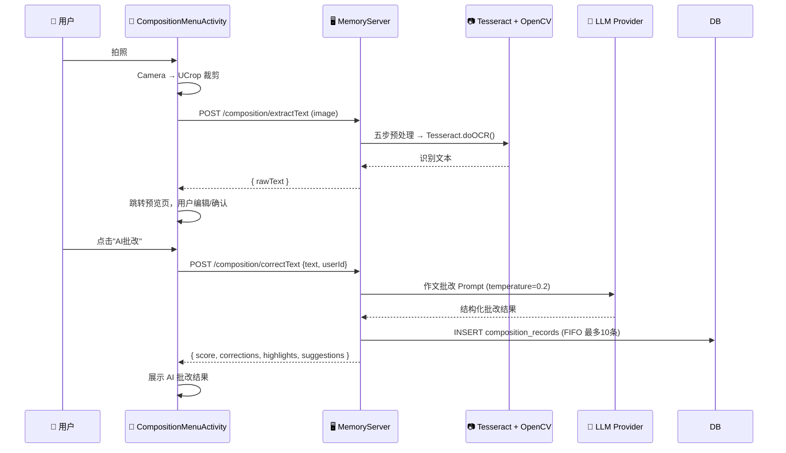

**AI 批改返回结构**：

```json
{
  "score": 85,
  "corrections": [
    { "type": "grammar", "original": "He go to school",
      "corrected": "He goes to school", "explanation": "主语第三人称单数，谓语动词需加 -s" }
  ],
  "highlights": ["使用了定语从句", "词汇丰富度良好"],
  "suggestions": "整体建议：注意主谓一致，多使用复合句提升表达复杂度..."
}
```

**FIFO 淘汰策略**：每用户最多保留 10 条批改记录，新记录插入时自动删除最旧记录。

---

## 11. 宝藏箱 — 发音练习模块

### 11.1 设计思路

发音练习模块提供**音素级**发音评价能力——不仅能给出整体分数，还能精准定位到"哪个词的哪个音素"发错了。这是通过 MemoryServerTTS 的 `phoneme_evaluator.py` 实现的：

```
学生录音 → ASR (Faster-Whisper) 转文字 → G2P 转音素 → 编辑距离对齐 → 逐词/逐音素诊断
```

整个评价过程只需要参考文本，不需要标准参考音频，大大扩展了使用场景。

### 11.2 服务端联动全景

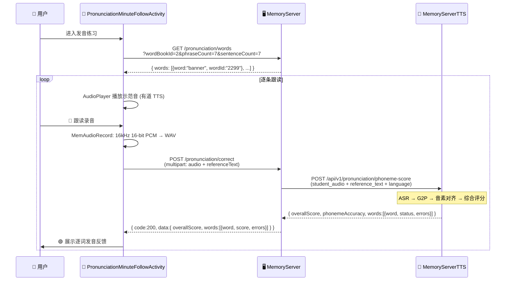

### 11.3 音素评价技术原理

**G2P（字素→音素转换）**：`g2p_engine.py` 负责将文字转换为音素序列。英文使用 `g2p-en` 库（基于 CMU Pronouncing Dictionary），将单词转为 ARPAbet 音素：

```
"Learning" → ["L", "ER", "N", "IH", "NG"]
"world"    → ["W", "ER", "L", "D"]
```

**音素对齐**：`phoneme_evaluator.py` 使用 Python `difflib.SequenceMatcher` 将参考文本的音素序列与 ASR 识别文本的音素序列进行编辑距离对齐：

| 操作类型 | 判定 | 示例 |
|---------|------|------|
| substitution | 音素被替换 | /ER/ → /AH/（"Learning" 的 "er" 读成 "ah"） |
| deletion | 音素被遗漏 | "and" 读成 "an"（漏了 /D/） |
| insertion | 多读额外音素 | "cat" 读成 "cater"（多了 /ER/） |

**评分公式**：
$$baseScore = phonemeAccuracy \times 100$$
$$missingPenalty = (缺失词数 / 总词数) \times 20$$
$$extraPenalty = \min(多余词数 \times 2, 10)$$
$$overallScore = \max(0, baseScore - missingPenalty - extraPenalty)$$

缺失词惩罚权重更大——遗漏单词比读错单词更严重（说明学生根本没开口）。

### 11.4 涉及文件

| 文件 | 职责 |
|------|------|
| `PronunciationMenuActivity.java` | 练习入口：每日跟读 / AI 对话 |
| `PronunciationMinuteFollowActivity.java` | 跟读练习主界面（RecyclerView + 逐条录音） |
| `PronunciationReportActivity.java` | 评分报告（总分 + 逐词详情） |
| `WordPhraseItem.java` / `WordPhraseListAdapter.java` | 词条数据模型与适配器 |
| `MemAudioRecord.java` | Android AudioRecord 封装（16kHz 16-bit PCM） |

### 11.5 Android 音频录制原理

```java
// MemAudioRecord 核心配置
int sampleRate = 16000;         // 16kHz 采样率（语音识别标准）
int channelConfig = CHANNEL_IN_MONO;  // 单声道
int audioFormat = ENCODING_PCM_16BIT; // 16位量化

int bufferSize = AudioRecord.getMinBufferSize(sampleRate, channelConfig, audioFormat);

AudioRecord audioRecord = new AudioRecord(
    MediaRecorder.AudioSource.MIC,  // 麦克风输入
    sampleRate, channelConfig, audioFormat, bufferSize
);
audioRecord.startRecording();

// 循环读取 PCM 数据写入 WAV 文件
byte[] buffer = new byte[bufferSize];
while (isRecording) {
    int bytesRead = audioRecord.read(buffer, 0, bufferSize);
    if (bytesRead > 0) outputStream.write(buffer, 0, bytesRead);
}
```

**为什么是 16kHz 16bit 单声道？** Faster-Whisper 和大多数 ASR 引擎的输入标准——高频信息（8kHz 以上）对语音识别贡献很小，16kHz 采样率（Nyquist 频率 8kHz）足以覆盖人类语音的频率范围。16bit 量化提供约 96dB 动态范围，足以区分语音信号和环境底噪。

---

## 12. 宝藏箱 — AI 对话模块

### 12.1 设计思路

AI 对话模块模拟真实英语口语交流场景，是整个系统中**技术链路最长、涉及服务最多的功能**。一次语音对话涉及 5 个服务调用：

```
用户录音 → MemoryServer → MemoryServerTTS (ASR 识别)
                          → DeepSeek API (对话生成)
                          → MemoryServerTTS (TTS 合成 AI 语音)
                          → DeepSeek API (对话质量评估)
        → 客户端 (播放语音 + 显示五维评分)
```

### 12.2 全链路调用时序图

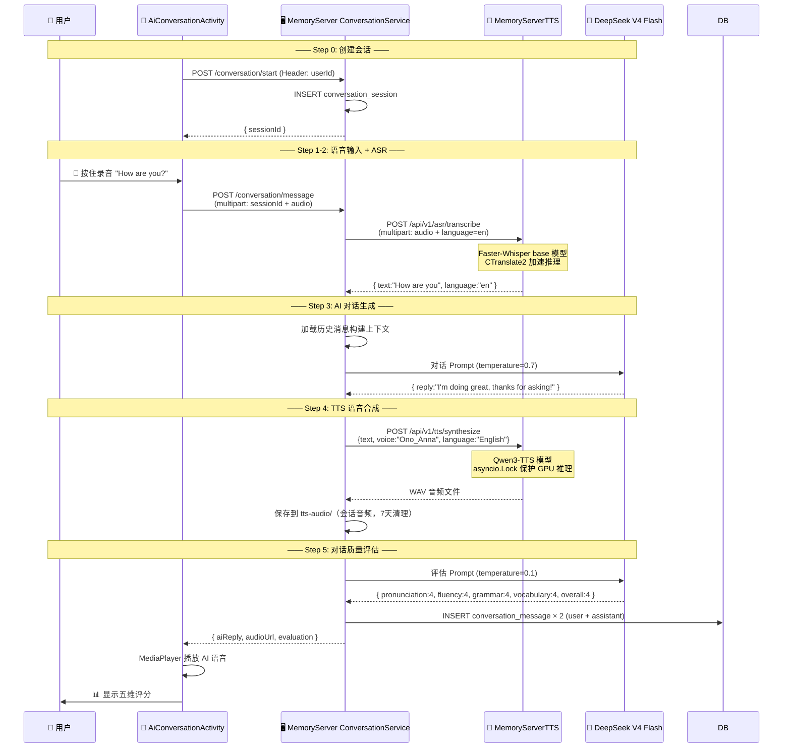

### 12.3 五维对话评估

每次 AI 回复后，DeepSeek 对用户的发言进行五个维度的评估：

| 维度 | 评分范围 | 评估内容 |
|------|---------|---------|
| Pronunciation | 1-5 | 发音准确性（基于 ASR 置信度推断） |
| Fluency | 1-5 | 流畅度（语速、停顿自然度） |
| Grammar | 1-5 | 语法正确性 |
| Vocabulary | 1-5 | 词汇丰富度和恰当性 |
| Overall | 1-5 | 综合评分 |

**教育心理学原理——Krashen 的情感过滤假说（Affective Filter Hypothesis）**：低焦虑环境有利于语言习得。AI 对话提供了一个"无评判空间"——用户不会因为说错而尴尬，AI 总是鼓励性地回应，降低了情感过滤。

### 12.4 涉及文件

| 文件 | 职责 |
|------|------|
| `AiConversationActivity.java` | 对话主界面（RecyclerView + 底部输入栏） |
| `AiMessage.java` | 消息数据模型（role/content/audioUrl/scores） |
| `AiConversationAdapter.java` | 消息列表适配器（左右气泡布局） |
| `MemAudioRecord.java` | 录音控制（按住录音、松开发送） |

---

## 13. 宝藏箱 — 学习评估模块

### 13.1 设计思路

学习评估模块是系统的**元认知仪表盘**，帮助用户"看见自己的学习"。所有数据在 MemoryServer 端从 `user_word_state` 和 `user_word_study_log` 表聚合计算，客户端仅负责可视化（MPAndroidChart）。

**教育心理学原理——元认知监控（Metacognitive Monitoring）**：Zimmerman（2002）的自我调节学习模型强调，学习者需要通过自我观察来评估学习策略的有效性。评估模块的仪表盘和趋势图正是这一自我观察的工具。

### 13.2 涉及文件

> 说明：原多个独立页面（Dashboard / Trend / Weekly / AiSuggestion / DeepAnalysis）已重构合并为
> 单页三 Tab 结构（`EvaluationActivity`），旧 Activity 与旧布局已清理删除。

| 文件 | 职责 |
|------|------|
| `EvaluationActivity.java` | 统一入口页，ViewPager2 + TabLayout 三个 Tab：学习概览 \| 深度分析 \| AI建议 |
| `evaluation_main_layout.xml` | 主页面布局（返回栏 + TabLayout + ViewPager2 + 进度条） |
| `evaluation_page_overview.xml` | Tab1 学习概览（概览卡片 + 掌握度饼图 + 近7日折线图 + 周报总结） |
| `evaluation_page_deep.xml` | Tab2 深度分析（FSRS 趋势 + 薄弱/危急单词） |
| `evaluation_page_ai.xml` | Tab3 AI建议（总体评估 + 建议列表 + 长期策略 + 即时反馈 + 应用设置） |

### 13.3 客户端解析注意事项

> ⚠️ **重要**：不同接口的 `data` 字段类型不同——有的返回 JSONObject，有的返回 JSONArray。

| 接口 | `data` 类型 | 内含数组字段 |
|------|-------------|-------------|
| `/evaluation/dashboard` | JSONObject | `recent7Days`, `masteryDistribution` |
| `/evaluation/trend` | JSONObject | `points` |
| `/evaluation/weeklyReport` | JSONObject | `topWeakWords`, `achievements` |
| `/evaluation/weakWords` | **JSONArray** ✅ | —（自身即数组） |
| `/evaluation/criticalWords` | **JSONArray** ✅ | —（自身即数组） |
| `/evaluation/masteryDistribution` | JSONObject | `buckets` |
| `/evaluation/fsrsTrend` | JSONObject | `points` |
| `/evaluation/deepAnalysis` | JSONObject | `bottom10Words`, `criticalWords` |

### 13.4 仪表盘核心指标

服务端 `/evaluation/dashboard` 返回的核心指标：

| 指标 | 含义 | 教学意义 |
|------|------|---------|
| `totalStudyDays` / `consecutiveDays` | 累计/连续学习天数 | 激励因子——连续天数激励用户保持习惯 |
| `learnedWords` / `totalWords` | 已学/总词数 | 进度感知 |
| `masteryRate` | 掌握率（$R \geq 0.9$ 的单词占比） | 核心掌握度指标 |
| `avgRetrievability` | 平均可提取性 $\bar{R}$ | 整体记忆健康度 |
| `avgStability` | 平均稳定性 $\bar{S}$（天） | 记忆牢固程度 |
| `avgDifficulty` | 平均难度 $\bar{D}$ | 当前学习内容难度水平 |
| `masteryDistribution` | 按 $R$ 分 10 个桶统计 | 微观掌握度分布 |

### 13.5 薄弱词与危急词

| 类型 | 判定条件 | 干预建议 |
|------|---------|---------|
| **薄弱词** | $R < 0.5$（回忆概率低于 50%） | 增加复习频率 |
| **危急词** | $D > 7.0$ 且 $R < 0.3$ 且连续失败 > 3 | 立即强攻复习，暂停新词 |

**危急词干预机制**：服务端 `criticalWords` 接口为每个危急词生成具体的 `intervention` 建议（如"建议暂停新词学习，立即强化复习"），体现了**适应性学习（Adaptive Learning）**——系统根据数据自动调整教学策略。

---

## 14. 每日阅读模块

### 14.1 设计思路

每日阅读模块利用用户的薄弱词数据，通过 AI 生成包含这些词的个性化文章。这体现了 **Krashen 的输入假说（i+1）**——文章难度略高于用户当前水平（因为包含了薄弱词），但在足够的语境支持下是可理解的。

**功能特性**：
- **每日一读**：服务端定时任务（凌晨 2 点）预生成文章，存入 `daily_reading_cache` 表
- **基于薄弱词生成**：`POST /composition/generateArticle` 根据用户薄弱词生成自定义文章
- **文章收藏**：支持收藏喜欢的内容到 `user_article_favorite` 表
- **逐句翻译**：每篇文章附带逐句中文翻译
- **高频词标注**：AI 标注文章中的重点词汇和详解

### 14.2 涉及文件

| 文件 | 职责 |
|------|------|
| `DailyReadingFragment.java` | 阅读主界面（Markdown 渲染 + 交互） |

### 14.3 Markdown 渲染（Markwon）

```java
Markwon markwon = Markwon.create(context);
markwon.setMarkdown(textView, articleContent);
```

Markwon 基于 commonmark-java，约 4 MB APK 增量。支持标准 Markdown 语法（标题/列表/粗体/斜体/链接）、自定义样式（字体大小/颜色/行间距）、图片异步加载（通过 Glide 集成）和代码块语法高亮。

---

## 15. 用户中心模块

### 15.1 设计思路

用户个人主页，提供设置入口和次级功能导航。核心交互：

| 功能 | 触发 | 技术实现 |
|------|------|---------|
| **头像** | 点击头像 → ImagePicker | Glide `circleCrop()` 展示 + `POST /auth/uploadUserAvatar` |
| **昵称** | 点击昵称 → Material Dialog 输入框 | `POST /auth/updateUserNickname` |
| **使用说明** | 点击"关于" | `ManualDialogFragment` Markdown 弹窗 |
| **重新登录** | 点击"退出" | 清除 InnerSettingsManager → LoginActivity |

### 15.2 涉及文件

| 文件 | 职责 |
|------|------|
| `UserHomeFragment.java` | 用户中心主界面 |
| `ManualDialogFragment.java` | 使用说明弹窗 |

### 15.3 次级导航

| 入口 | 目标 Activity | 功能 |
|------|-------------|------|
| 我的词书 | `MyWordBookActivity` | ViewPager2：收藏词 + 薄弱词 |
| 学习报告 | `EvaluationActivity` | 学习评估（概览 / 深度分析 / AI建议 三 Tab） |
| 设置 | `SettingActivity` | 学习偏好、环境切换 |
| 计划管理 | `PlanListActivity` / `PlanCheckActivity` | 计划列表、进度查看 |

---

## 16. 扩展功能模块

### 16.1 我的词书 (`my_word_view/`)

采用 **ViewPager2 + TabLayout** 实现双 Tab：

| Tab | API | 排序 |
|-----|-----|------|
| 收藏单词 | `GET /learning/getFavoriteWords` | 收藏时间倒序 |
| 薄弱单词 | `GET /learning/getWeakWords` | $R$ 升序（最薄弱在前） |

### 16.2 多源查词 (`word_search_view/`)

ViewPager2 承载 4 个 Fragment，分别从不同来源查询：

| Tab | 数据源 | 技术实现 |
|-----|--------|---------|
| 本地词库 | `LexiconResourceMap.getWordByRank()` | 内存缓存查询 |
| Bing 词典 | `https://cn.bing.com/dict/search?q={word}` | WebView 加载 |
| 牛津词典 | 牛津在线词典 | WebView 加载 |
| 剑桥词典 | 剑桥在线词典 | WebView 加载 |

**为何使用 WebView 而非 API？** 在线词典通常没有公开 API，通过 WebView 加载网页是最可靠的方案。

### 16.3 设置页 (`setting_view/`)

| 设置项 | 存储键 | 默认值 | 防抖延迟 |
|--------|--------|--------|---------|
| 学习模式 | `study_mode` | `"choice"` | 800ms |
| 每日新词数 | `daily_new_words` | `10` | 800ms |
| 右滑返回 | `is_slide_back` | `true` | — |

防抖策略：设置变更后延迟 800ms 再调用 `PUT /learning/updatePreference`，避免用户连续滑动 NumberPicker 时发出大量重复请求。

---

## 17. 网络通信层

### 17.1 网络层架构（2026-08 已收敛为 MemoryApiClient 单栈）

```text
ApiConstants（环境中间件：DEV/TEST/PROD + getFullUrl 拼接 + 共享网络线程池 execute）
        │
        └── MemoryApiClient（网络层唯一入口）
              ├── Retrofit 域接口工厂：auth()/learning()/composition()/conversation()/
              │      evaluation()/pronunciation()（AuthApi / LearningApi / CompositionApi /
              │      ConversationApi / EvaluationApi / PronunciationApi）
              ├── ApiBridge（Retrofit Call → 项目统一 Handler+Message 桥接：
              │       2xx 且非空体 → sendMessage(ok, body)；网络层失败/空体按 1s、2s 指数退避重试后 fail）
              └── 底层专用能力（Retrofit 不便表达，原 HttpManager 迁移，2026-08 阶段4合并）：
                     postStream(SSE) / downloadWav(TTS) / doHttpGetNoPara / streamingPart(流式文件体)
```

- **单一共享连接池**：`MemoryApiClient.client()` 持有唯一的 `OkHttpClient`（连接 15s / 读写 120s /
  `retryOnConnectionFailure(true)`），所有域接口与底层专用能力共用同一连接池与 Dispatcher；
- **公共返回语义**（与历史一致）：仅 HTTP 200 返回响应体，其他状态码/异常返回 null，由调用方判空；
  Authorization: Bearer 由 `MemoryApiClient` 按请求附带（multipart 上传除外，与旧版一致）；
- **异步统一**：网络任务经 `ApiConstants.execute()`（共享网络线程池 `memory-net-*`）或 Retrofit enqueue
  （OkHttp 自带线程池），不再散落 `new Thread`；
- **SSE 流式**：`MemoryApiClient.postStream()` 基于共享 OkHttp 返回可流式读取的 Response（AI 对话流式回复）。

### 17.2 环境切换

```java
public enum Environment { DEV, TEST, PROD }

// 地址由 local.properties 注入 BuildConfig（见 app/build.gradle）：
//   BACKEND_DEV_URL  — 开发机直连
//   BACKEND_TEST_URL — frp 端口转发（外网可访问）
//   BACKEND_PROD_URL — 生产服务器
// 公共仓库仅含占位符，真实地址不提交到版本库。

ApiConstants.setEnvironment(Environment.TEST); // 默认 TEST（ApiConstants 默认值）
```

- 默认环境 **TEST**（`ApiConstants` 默认值，与历史有效行为一致）；
- **运行期切换立即生效**：URL 在调用时经 `getFullUrl()` 解析；`MemoryApiClient` 每次
  `get()` 比对 baseUrl，变化时自动重建 Retrofit（DCL 单例）；
- **URL 拼接唯一入口**：`ApiConstants.getFullUrl(path)`，禁止手写 `getBaseUrl() + "/xxx"`。

### 17.3 MemoryApiClient 底层专用能力（原 HttpManager 迁移）

> 阶段 3（2026-08）业务请求已全部迁移至 Retrofit 域接口（经 `ApiBridge`）；
> 阶段 4（2026-08）完成合并，`HttpManager` / `GetDataByThread` 已彻底删除，
> 下列 Retrofit 不便表达的专用能力全部收敛到 `MemoryApiClient`：

```java
postStream(url, headers, form)                            // SSE 流式（AI 对话）
downloadWav(url, json, context)                           // TTS：POST JSON → 存 wav 文件，返回路径
streamingPart(context, uri, mime)                         // multipart 流式文件体（ApiBridge.filePart 复用）
doHttpGetNoPara(url)                                      // 遗留：AiConversationActivity 音频轮询
getLastImageUploadError()                                 // 图片上传失败原因（无调用方，恒返回 null）
```

- 超时：连接 15s / 读写 120s（覆盖 OCR 90s 场景）；上传保持"流式"（contentLength 预读 + 边读边写）。

### 17.4 阶段 3 迁移记录（GetDataByThread → Retrofit 域接口）

- **GetDataByThread 全部公开方法**改为固定端点的域接口调用（经 `ApiBridge.enqueue` 桥接，
  响应语义与历史一致：2xx 非空体 → ok/body，网络层失败 1s、2s 指数退避重试后 fail），
  **公开签名不变，UI 调用方零改动**；构造传入的 path 不再决定实际端点（`urlPath`/`getUrl_path()`
  仅保留给 UserHomeFragment 用 Glide 加载头像）。
- **语义错配调用点已修正**（历史「构造路径 ≠ 方法语义」的隐患）：
  - `WordLearningFragment.loadTodayTask`：`getPlan()` 改调新方法 `getTodayTask()`
    （GET /learning/getTodayTask，原实现实际打到该路径但语义叫 getPlan）；
  - `PlanListActivity`：`getPlanDetails()` 改调 `getUserAllLearningPlans()`
    （GET /learning/getUserAllLearningPlans，原实现想拉全部计划却调了详情方法）；
  - `DailyReadingFragment` 生成文章分支：新增 `generateArticle()`（GET /composition/generateArticle），
    按模式分发；每日一读仍走 `getDailyReading()`。
- **顺带修复隐藏 bug**：`AiConversationActivity.exitCurrentMode` 用的 `switchMode` 旧实现存在
  **双路径拼接**（构造 `/conversation/{sid}/mode` + 方法内 `url + "/" + sid + "/mode?mode="` →
  实际请求 `/conversation/{sid}/mode/{sid}/mode?...`，生产上大概率 404）；
  迁移到 `ConversationApi.switchMode`（POST /conversation/{sid}/mode?mode=…）后路径正确。
- **直连调用点迁移**：`DictationApiHelper` 六个方法全部委托 `LearningApi` 听写子域；
  `DailyReadingFragment` 收藏/收藏列表/详情/阅读计数/删除 5 处直连改走 `CompositionApi`；
  `DictationExecutionActivity.uploadForOcr` 改走 `CompositionApi.extractText`
  （multipart 流式，字段 `image` 与图片质量策略不变）。
- **依赖收敛**：`MemoryApiClient` 的 `api`（MemoryApi）入口保留（AI 配置域兼容），
  业务域统一从 `auth()/learning()/composition()/conversation()/evaluation()/pronunciation()` 获取。
- **迁移后端点级校验修正（2026-08 对真实后端全量探测发现 2 处路径错配）**：
  - `uploadWordStudyLog`：方法名被误当路径写成 `POST /learning/uploadWordStudyLog`（404），
    历史 wire 实为后端 `POST /learning/updateWordStudyLog`，已修正（该方法为兼容层保留的死方法，无 UI 调用点）；
  - `recommendedTopics`：写成 `GET /conversation/topics`（404），后端实为
    `GET /conversation/topics/recommended`，已修正；
  - 全量端点探测其余路由均与后端一致（`switchMode` 端到端验证：start→switchMode→sessions 全链路 200）。

### 17.5 阶段 4 完成记录（2026-08：两旧类彻底删除，网络层收敛为 MemoryApiClient 单栈）

- **合并**：`HttpManager` 全部底层能力（`client()` / `postStream` / `downloadWav`（原 doHttpPostDownloadWav）/
  `doHttpGetNoPara` / `streamingPart` / `getLastImageUploadError` 等）迁入 `MemoryApiClient`，后者自持
  `sClient` 单一共享连接池，不再依赖旧类；`doHttpPost`（已废弃 aiConversation）无 UI 调用方，直接删除。
- **API 收敛**：`ApiBridge.filePart` 改走 `MemoryApiClient.streamingPart`。
- **UI 调用点现代化（20 文件）**：`new GetDataByThread(path).xxx(handler, ok, fail, args...)` 全部改为
  `ApiBridge.enqueue(MemoryApiClient.域().xxx(args...), handler, ok, fail, tag)`；GetDataByThread 内部组装的
  JSONObject 内联到调用点（try/catch JSONException，失败 `sendEmptyMessage(fail)`/Toast+return）；语义/消息码/重试不变。
- **getUrl_path() 替代**：UserHomeFragment 头像 Glide 加载由 `new GetDataByThread(path).getUrl_path()` 改为
  `ApiConstants.getFullUrl(path)`。
- **AI 对话直连点**：`AiConversationActivity` 的 `HttpManager.postStream` → `MemoryApiClient.postStream`、
  `HttpManager.doHttpGetNoPara` → `MemoryApiClient.doHttpGetNoPara`、TTS 合成 `synthesizeTts` → 内联
  `ApiConstants.execute + MemoryApiClient.downloadWav`（新增私有 `requestTts(String)`）。
- **删除**：`GetDataByThread.java` + `HttpManager.java`（grep 确认代码层零引用，仅文档/Javadoc 历史提及）。
- 附带修正：`sendAudioToServer` 误删 `Uri audioUri` 定义已恢复。

### 17.4 API 端点完整清单

| # | 方法 | 路径 | 传参方式 | Auth | 说明 |
|---|------|------|---------|------|------|
| 1 | GET | `/auth/login` | Header: phone, password | — | 登录 |
| 2 | POST | `/auth/register` | Header: phone, password, nickname | — | 注册 |
| 3 | GET | `/auth/getUserInfo` | Header: userId | ✅ | 用户信息 |
| 4 | GET | `/auth/getCurrentPlan` | Header: userId | ✅ | 当前计划 |
| 5 | POST | `/auth/setPlan` | Header: userId, planId | ✅ | 切换计划 |
| 6 | GET | `/auth/avatar/{userId}` | Path: userId | — | 头像 |
| 7 | POST | `/auth/uploadUserAvatar` | Header: userId, Form: image | ✅ | 上传头像 |
| 8 | POST | `/auth/updateUserNickname` | Header: userId, Body | ✅ | 改昵称 |
| 9 | POST | `/composition/processImage` | Form: image | — | OCR 预处理 |
| 10 | POST | `/composition/extractText` | Form: image | — | OCR 提取文字 |
| 11 | POST | `/composition/extractDictation` | Form: image, taskId, itemCount | — | 听写 OCR |
| 12 | POST | `/composition/correctText` | Body: {text}, Header: userId | ✅ | AI 批改文本 |
| 13 | POST | `/composition/correct` | Form: image, Header: userId | ✅ | 图片→OCR→批改 |
| 14 | GET | `/composition/records` | Header: userId | ✅ | 作文记录 |
| 15 | DELETE | `/composition/record/{id}` | Path: id | ✅ | 删除记录 |
| 16 | GET | `/composition/generateArticle` | Header: userId | ✅ | 生成文章 |
| 17 | GET | `/composition/dailyReading` | Header: userId | ✅ | 每日一读 |
| 18 | POST | `/composition/dailyReading/favorite` | Body | ✅ | 收藏文章 |
| 19 | POST | `/learning/planUpload` | Body | ✅ | 创建计划 |
| 20 | GET | `/learning/getTodayTask` | Header: userId | ✅ | 今日任务 (FSRS) |
| 21 | GET | `/learning/getLearningPlanDetails` | Header: userId | ✅ | 计划详情 |
| 22 | GET | `/learning/getUserAllLearningPlans` | Header: userId | ✅ | 所有计划 |
| 23 | POST | `/learning/submitAnswer` | Body | ✅ | 提交答案 |
| 24 | POST | `/learning/updateLearningListCompletion` | Header: userId | ✅ | 标记完成 |
| 25 | GET | `/learning/getWeakWords` | Header: userId, lexiconId | ✅ | 薄弱词 |
| 26 | GET | `/learning/getFavoriteWords` | Header: userId, lexiconId | ✅ | 收藏词 |
| 27 | POST | `/learning/setFavorite` | Header | ✅ | 设收藏 |
| 28 | GET | `/learning/getSchedulePreview` | Header: userId | ✅ | 预览计划 |
| 29 | PUT | `/learning/updatePreference` | Body | ✅ | 更新偏好 |
| 30 | POST | `/pronunciation/correct` | Form: audio, referenceText | — | 发音纠正 |
| 31 | POST | `/pronunciation/recognize` | Form: audio | — | ASR 识别 |
| 32 | GET | `/pronunciation/words` | Query | ✅ | 跟读列表 |
| 33 | POST | `/conversation/start` | Header: userId | ✅ | 开始会话 |
| 34 | POST | `/conversation/message` | Form: sessionId, audio/text | ✅ | 发送消息 |
| 35 | GET | `/conversation/history` | Query: sessionId | ✅ | 会话历史 |
| 36 | GET | `/conversation/last` | Header: userId | ✅ | 最近会话 |
| 37 | POST | `/tts/synthesize` | Form: text | — | TTS 合成 |
| 38 | POST | `/learning/dictation/generate` | Body | ✅ | 生成听写任务 |
| 39 | GET | `/learning/dictation/{taskId}` | Path | — | 听写任务详情 |
| 40 | POST | `/learning/dictation/submit` | Body | — | 提交听写 |
| 41 | GET | `/learning/dictation/history` | Query: userId | ✅ | 听写历史 |
| 42 | POST | `/learning/dictation/retry-wrong` | Body | ✅ | 错词重练 |
| 43 | GET | `/evaluation/dashboard` | Header: userId | ✅ | 仪表盘 |
| 44 | GET | `/evaluation/trend` | Header: userId, Query: days | ✅ | 趋势 |
| 45 | GET | `/evaluation/weeklyReport` | Header: userId | ✅ | 周报 |
| 46 | GET | `/evaluation/aiSuggestion` | Header: userId | ✅ | AI 建议 |
| 47 | GET | `/evaluation/weakWords` | Header: userId, Query: topN | ✅ | 最弱单词 |
| 48 | GET | `/evaluation/criticalWords` | Header: userId | ✅ | 危急单词 |
| 49 | GET | `/evaluation/masteryDistribution` | Header: userId | ✅ | 掌握度分布 |
| 50 | GET | `/evaluation/fsrsTrend` | Header: userId, Query: days | ✅ | FSRS 趋势 |
| 51 | GET | `/evaluation/deepAnalysis` | Header: userId | ✅ | 综合深度分析 |

---

## 18. 工具与辅助模块

### 18.1 AudioPlayer — 有道词典 TTS

```java
// 英式发音: https://dict.youdao.com/dictvoice?audio={word}&type=1
// 美式发音: https://dict.youdao.com/dictvoice?audio={word}&type=2

AudioPlayer.playAudio(context, word, AudioPlayer.TYPE_UK);  // 英式
AudioPlayer.playAudio(context, word, AudioPlayer.TYPE_US);  // 美式
```

内部使用 `MediaPlayer` + `prepareAsync()` 异步准备，播放完毕自动 `release()`。与听写模块的 MemoryServerTTS 不同，有道 TTS 用于单词学习页面的快速发音示范——不需要高质量 AI 合成，只需要快速的标准发音参考。

### 18.2 本地词库 (`LexiconResourceMap`)

60+ 词库以 JSON 形式存储在 `res/raw/` 目录下，通过 `LexiconResourceMap` 按需加载到 LRU 内存缓存。

**WordEntry 结构**：

```java
class WordEntry {
    String headWord;                  // 拼写 (如 "abandon")
    int wordRank;                     // 序号 (如 1)
    String usPhone, ukPhone;          // 音标 (如 "/əˈbændən/")
    String usSpeechUrl, ukSpeechUrl;  // 有道 TTS 发音参数
    String[] chineseTranslations;     // 中文释义
    String[] englishDefinitions;      // 英文释义
    ExampleSentence[] exampleSentences; // 例句 (EN + CN)
}
```

本地词库是 App 体积的主要贡献者（60+ JSON 文件，总计约 15-20 MB）。这些数据在编译时被打包进 APK 的 `res/raw` 目录，运行时按需加载，避免全量加载导致 OOM。

---

## 19. 设置管理系统

> **集中管理原则**：自 v2.1 起，**所有 SharedPreferences 访问一律收敛到 `settings/` 包**。任何 Activity/Fragment 不得直接调用 `getSharedPreferences()`。新增持久化需求先在对应管理器中扩展方法。详见 [开发约束与规范](development-conventions.md) §2.2。

### 19.1 UserSettingsManager（用户偏好，文件 `AppSettings`）

**设计模式**：线程安全单例 + 观察者模式。

```java
public class UserSettingsManager {
    private static volatile UserSettingsManager instance;
    private final List<OnSettingsChangedListener> listeners;

    private void notifySettingsChanged(String key, Object value) {
        for (OnSettingsChangedListener listener : listeners) {
            listener.onSettingChanged(key, value);
        }
    }
}
```

**存储键清单**：

| 键 | 类型 | 默认值 | 说明 |
|----|------|--------|------|
| `KEY_IS_SLIDE_BACK` | boolean | true | 用户右滑是否回到上一个卡片 |
| `KEY_STUDY_MODE` | String | "choice" | 学习模式: "choice" / "input" |
| `KEY_DAILY_NEW_WORDS` | int | 10 | 每日新学单词数 |
| `KEY_READER_FONT_SIZE` | int | 19 | 阅读字号（每日一读） |
| `KEY_THEME_MODE` | int | 0 | 主题模式: 0 跟随系统 / 1 浅色 / 2 深色 |

**观察者模式应用**：`WordLearningFragment` 注册监听 `study_mode` / `is_slide_back` 变更，实时切换模式而无需重启 Activity；主题模式由 `ThemeHelper` 调用本管理器读写。

### 19.2 InnerSettingsManager（应用内部信息记录器）

**设计模式**：线程安全单例，内部持有多个 SharedPreferences 文件引用，对外统一提供方法。

**① 登录 / 用户信息（文件 `UserPrefs`）**

| 方法 | 说明 |
|------|------|
| `getUserId()` / `setUserId(int)` | 当前用户 ID |
| `isLoggedIn()` / `setLoggedIn(int)` | 0=未登录, 1=新注册, 2=老用户 |
| `getNickName()` / `setNickName(String)` | 昵称 |
| `getUserName()` / `setUserName(String)` | 用户名 |
| `getAvatarUrl()` / `setAvatarUrl(String)` | 头像 URL |
| `clear()` | 清空登录信息 |

**② 每日收藏（文件 `DailyFavoritePrefs`，按 userId 隔离）**

| 方法 | 说明 |
|------|------|
| `getDailyFavoriteId(int userId)` | 今日收藏文章 ID（无则 -1） |
| `getDailyFavoriteDate(int userId)` | 今日收藏日期（yyyy-MM-dd） |
| `saveDailyFavorite(int userId, long favoriteId, String date)` | 保存今日收藏 |
| `clearDailyFavorite(int userId)` | 清除今日收藏 |

**③ 作文草稿（文件 `CompositionPrefs`，按 userId 隔离）**

| 方法 | 说明 |
|------|------|
| `getCompositionDraft(int userId)` | 草稿内容 |
| `getCompositionDraftSaveTime(int userId)` | 草稿保存时间戳 |
| `saveCompositionDraft(int userId, String text, long saveTime)` | 保存草稿 |

**④ 发音每日成绩（文件 `pronunciation_daily_scores`，按日期存储，内部 key `scores_yyyy-MM-dd`）**

| 方法 | 说明 |
|------|------|
| `savePronunciationScores(String date, String json)` | 保存某日成绩 |
| `getPronunciationScores(String date)` | 读取某日成绩 |
| `getPronunciationScoreDates()` | 所有已存成绩的日期集合 |
| `removePronunciationScores(String date)` | 删除某日成绩 |

### 19.3 学习进度持久化（`DailyStateManager`）

每日单词学习的"今日已完成"状态由 `main_view/DailyStateManager` 独立封装（key 为 `{userId}_completedWordIds` / `_completedLastDate` / `_completedWordDetails`），支持跨天自动重置。该管理器是 feature 内部封装，保持独立。

---

## 20. 第三方依赖

| 依赖 | 版本 | 用途 | 选型理由 |
|------|------|------|---------|
| `androidx.appcompat` | 1.6.1 | 向后兼容的 ActionBar/Activity | AndroidX 标准库 |
| `material` | 1.10.0 | Material Design 组件 | Google 官方 UI 组件库 |
| `constraintlayout` | 2.1.4 | 约束布局 | 性能优于嵌套 LinearLayout |
| `Glide` | 4.12.0 | 图片加载与缓存 | `circleCrop()` 等变换，自动缓存 |
| `uCrop` | 2.2.8 | 图片裁剪（Yalantis） | 自由裁剪 + 预设比例 |
| `Markwon` | 4.6.2 | Markdown 渲染 | 约 4MB 增量，支持图片异步加载 |
| `MPAndroidChart` | 3.1.0 | 图表绘制（PhilJay） | 饼图/折线图/柱状图 |
| `Material Dialogs` | 3.3.0 | 对话框组件（afollestad） | 输入弹窗、确认对话框 |
| `nice-spinner` | 1.3.1 | 下拉选择器（arcadefire） | 比原生 Spinner 更美观 |
| `OkHttp + logging-interceptor` | 4.12.0 | 底层 HTTP（统一连接池） | 替代 Apache HttpClient（已移除 libs 内 httpclient 4.2.5 等旧 jar） |
| `Retrofit + converter-scalars` | 2.11.0 | 新栈声明式接口 | MemoryApiClient / MemoryApi |
| `JUnit` | 4.13.2 | 单元测试 | Java 标准测试框架 |
| `Espresso` | 3.5.1 | UI 自动化测试 | Google 官方 Android UI 测试框架 |

---

## 21. 构建与部署

### 21.1 构建命令

```bash
.\gradlew.bat assembleDebug       # 编译 Debug APK
.\gradlew.bat assembleRelease     # 编译 Release APK
.\gradlew.bat installDebug        # 安装到设备
.\gradlew.bat test                # 运行单元测试
.\gradlew.bat connectedAndroidTest # 运行仪器化测试
```

### 21.2 权限申明

```xml
<uses-permission android:name="android.permission.INTERNET" />
<uses-permission android:name="android.permission.ACCESS_NETWORK_STATE" />
<uses-permission android:name="android.permission.CAMERA" />
<uses-permission android:name="android.permission.WRITE_EXTERNAL_STORAGE" />
<uses-permission android:name="android.permission.READ_EXTERNAL_STORAGE" />
<uses-permission android:name="android.permission.RECORD_AUDIO" />
```

### 21.3 开发约定

| 约定 | 说明 |
|------|------|
| **MVC 架构** | Activity/Fragment 直接持有业务逻辑 |
| **Handler 异步** | `new Thread()` + `Handler.sendMessage()` |
| **HttpClient** | 保持 Apache HttpClient |
| **JSON** | `org.json.JSONObject` 手动解析 |
| **Fragment 导航** | `show()/hide()` 而非 `replace()` |
| **持久化** | `SharedPreferences` |

---

> **文档维护说明**：本文档随项目迭代持续更新。MemoryServer（服务端）和 MemoryServerTTS（语音服务）的详细文档见各自仓库。如有新增模块或架构变更，请同步更新对应章节。
